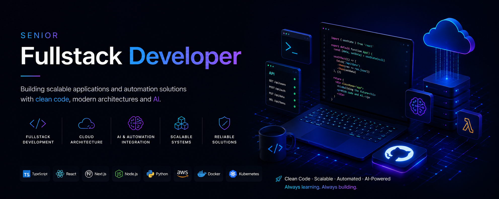

Hi! I'm Mario Aquino 🇦🇷Senior Full-Stack Developer | AI & Automation Architect
Passionate about building scalable applications and automation solutions with clean code, modern architectures, and AI integration. I focus on reducing operational friction through technology.

🚀 Currently building:
* Kosame: An AI-powered voice-to-user stories translator with Trello & n8n integration.
* Multi-agent Workflows: Developing automated product requirement analysis using local LLMs (Ollama).

🛠️ Core Tech Stack:
* Backend: Node.js (NestJS), Python (FastAPI/Django), Go, PostgreSQL, Redis.
* Frontend: React, Next.js, TypeScript, Tailwind CSS.
* Cloud & DevOps: AWS (EKS, Lambda), Docker, Kubernetes, Terraform, GitHub Actions.
* AI & Data: LLM Orchestration (LangChain), n8n, Apache Kafka.

📫 Connect with me:LinkedIn: keyzdev
* Email: marioaquinojob@gmail.com 🌎 Open to remote opportunities & relocation.   
